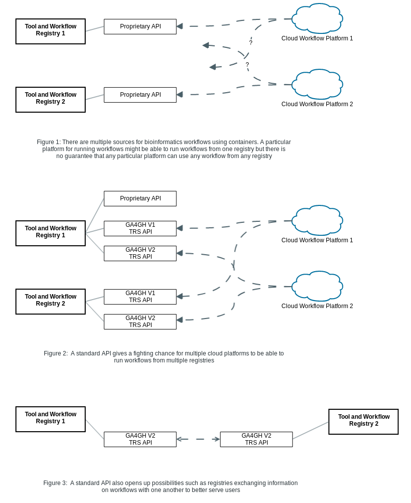

### Introduction

Currently, this is the home of the GA4GH Tool Registry API proposal. Tools or workflows (both terms are often used interchangeably in this series of documents and in the community) will be defined as a data manipulation step or a series of steps respectively. These steps can be linearly sequential or fan out in a tree and then aggregate the results in what is often called a [DAG](https://en.wikipedia.org/wiki/Directed_acyclic_graph). Each individual step often (but is not limited to) executes an individual script or binary executable and thus data is fed from overall input files, is manipulated by each step, and eventually results in output files.  

Workflows are stored in a variety of different locations with incompatible metadata (such as authorship, tagged versions, working parameter sets), are written in a variety of workflow languages, and often do not have their dependencies documented in a consistent way. This makes it difficult for researchers from different groups (or even in some cases, for researchers from the same group at a different time) to re-run workflows. 

This proposal is part of an effort to create a standard and interoperable way to build and exchange workflows between groups so that developers that build and contribute workflows to the community can have some confidence that other groups working in a very different cloud environment can run their workflow. 

Initially, the registry API is intended on being a minimal common API for describing tools that we propose for implementation by registries like [Dockstore](https://www.dockstore.org/) and [Agora](https://github.com/broadinstitute/agora) balancing the need for a simple set of requirements for implementors while still being useful for users of the API. The API is intended to be used for tasks like exchanging, indexing, and searching workflows from the bioinformatics community and beyond. 

With a number of different repositories for storing bioinformatics workflows, it would be useful to settle on a way for different repositories to communicate with one another while recognizing that there are many valid different approaches and design decisions that can go into a registry project such as:

*  where are the containers hosted (a private registry, a public registry, built on demand?)
*  how are descriptors for those containers stored (source control, database)
*  what is the format for descriptors?
*  how is a registry secured (or not!) 

Our intent is to allow registries built with different assumptions to communicate with one another and be discoverable by third party indexing or aggregation services. 

#### Use Cases

##### Users

Users will be able to access a larger universe of tools while still having the ability to go to the authoritative source for a tool for full information or to contact the author of a tool.

##### Tool Developers

Tool developers will be able register their tools and automatically have them visible on a number of different sites that exchange metadata via this API, allowing them to reach a larger audience.

##### Registry Developers

Registry developers will be able to develop services to either aggregate, index, or mirror tools found on different registries similar to either the remote repositories mechanism in [Maven](https://maven.apache.org/guides/introduction/introduction-to-repositories.html) or the repository mechanism in [Apt](https://help.ubuntu.com/community/Repositories/CommandLine#Adding_Repositories).     

In summary, we envision a world where bioinformatics workflows (and workflows from other interested fields) can be freely exchanged with no technical barriers between a variety of cloud environments, allowing researchers to easily re-use workflows and reduce the effort of reimplementing workflows for use in different platforms. 

Discussion of the models and endpoints in details continues at [Data Model](../DataModel)

